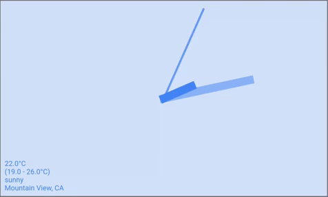
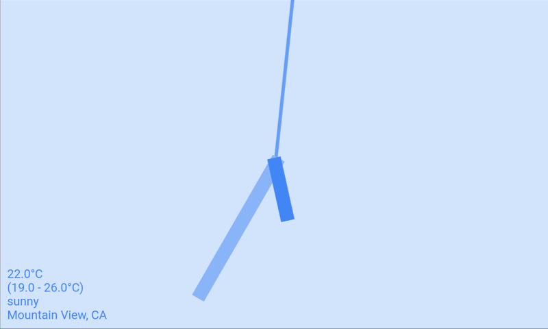

# Scuba Clock

This app is a scuba-themed analog clock, created for the Flutter CLock Challenge.
It displays the actual time and date, and sample weather and location data.

This project's code is licensed under the terms of the BSD 3-Clause license. Image assets are licenced under the Creative Commons Attribution Share Alike 4.0 license.

